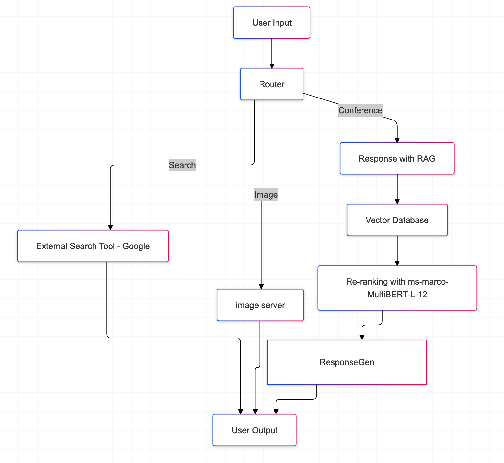

### Chat Bot avec une base de connaissances (KB)




<br>
Chat Bot avec un KB local pour Confoo

L'objectif de ce bot est de permettre de répondre aux questions d'un utilisateur sur une base de connaissances qui est privée.


Utilisation de [LangChain](https://langchain.readthedocs.io/en/latest/index.html) pour fabriquer une base de données de connaissances en locale avec le contenu du fichier [devmtl-RAG.txt](data/devmtl-RAG.txt).

Utilisation de [OpenAI](https://platform.openai.com/docs/introduction) pour le [LLM](https://www.mlq.ai/what-is-a-large-language-model-llm/) (Large Language Model).

Gestion des routes sémantiques avec [semantic-router](https://github.com/aurelio-labs/semantic-router)

Utilisation de [SreamLit](https://docs.streamlit.io/) pour gérer le server et l'interface Web du Bot.

Pour générer des images, il est necessaire d'avoir un serveur ComfyUI dont l'URL est configuré dans le fichier [.env](.env)
```sh
COMFYUI_SERVER_ADDRESS=
```


Pour installer les librairie Python requises:

```sh
./setup.sh
```

Initialiser toutes les clés d'API pour OpenAI, Langsmith et Google search, etc dans un fichier .env (à créer)
```sh
COMFYUI_SERVER_ADDRESS=
OPENAI_API_KEY=
LANGCHAIN_TRACING_V2=true
LANGCHAIN_ENDPOINT="https://api.smith.langchain.com"
LANGCHAIN_API_KEY=
LANGCHAIN_PROJECT="semantic-router"
GOOGLE_API_KEY=
GOOGLE_CSE_ID=
```

Pour exécuter le chat Bot:
```sh
./start.sh
```


Vous pouvez maintenant poser votre question...
